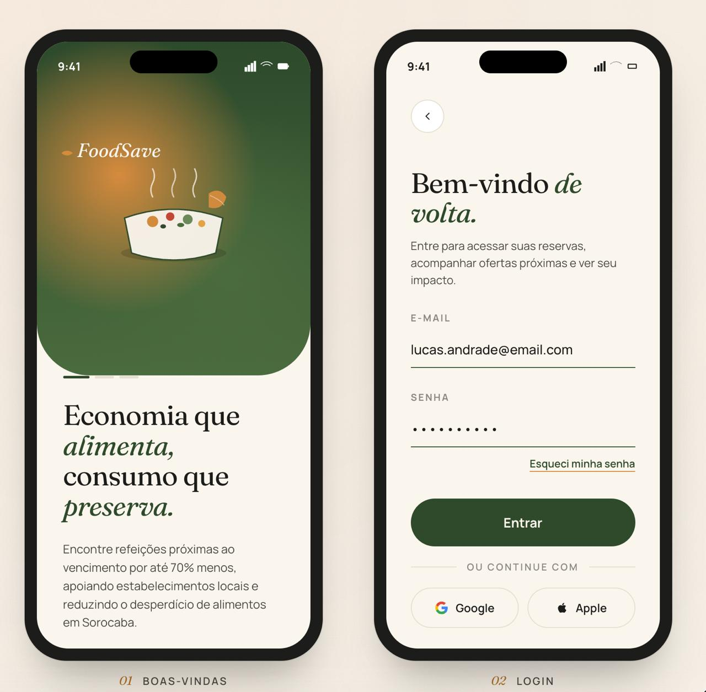
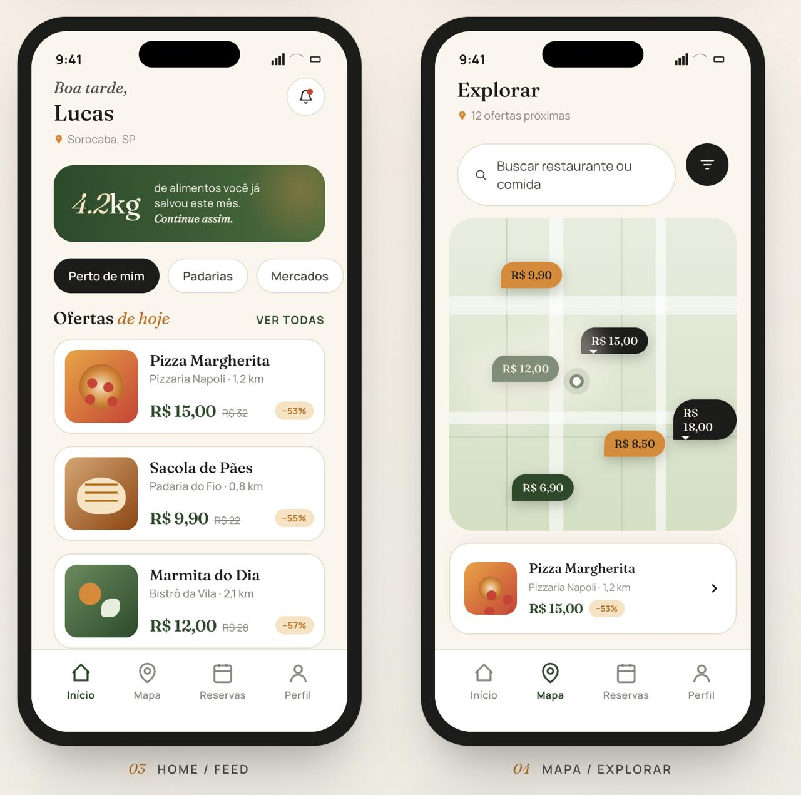
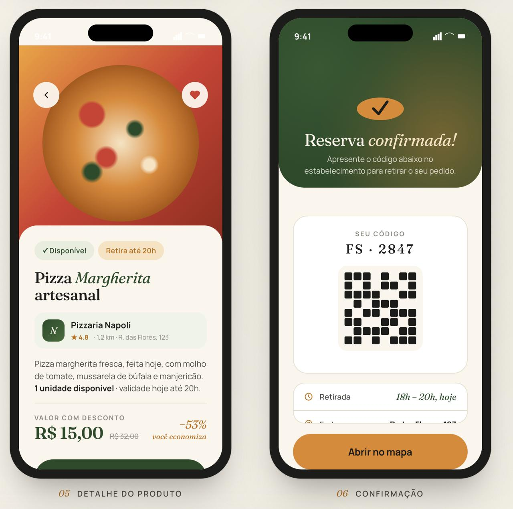
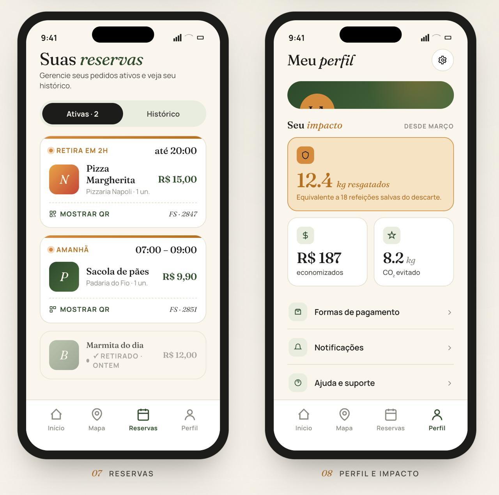

# FoodSave

> Conectamos restaurantes, padarias, mercados e hortifrutis a consumidores que querem comprar produtos próximos ao vencimento por até **70% menos** — reduzindo o desperdício alimentar e gerando renda para o comércio local.



---

## O problema que resolvemos

A cada ano o mundo desperdiça **1,05 bilhão de toneladas de alimentos** (UNEP Food Waste Index, 2024). No Brasil, cerca de **30% de toda a comida produzida** vai para o lixo, o que representa **mais de R$ 1,3 bilhão em perdas anuais** apenas para o varejo de alimentos. Ao mesmo tempo, milhões de famílias enfrentam insegurança alimentar e estabelecimentos pequenos fecham por margens cada vez mais apertadas.

O FoodSave existe para que produtos próximos do vencimento — uma pizza pronta às 19h, uma sacola de pães do dia, uma marmita preparada que não vendeu — encontrem alguém que ainda quer consumi-los, com desconto agressivo e dignidade para o comerciante.

## Proposta de valor

- **Para o consumidor**: encontrar refeições e mercados de qualidade por uma fração do preço, perto de casa, com retirada em poucos minutos via QR Code. Acompanhar o próprio impacto (kg salvos, CO₂ evitado, R$ economizados) em tempo real.
- **Para o estabelecimento**: recuperar capital de produtos que iriam pro descarte, fidelizar clientes que conhecem o estabelecimento por descontos relevantes, e receber **alertas preditivos** sugerindo o desconto ideal antes do vencimento.

## Público-alvo

- **Consumidores**: famílias e estudantes em centros urbanos (foco inicial em Sorocaba/SP), interessados em economia, alimentação consciente e impacto ambiental.
- **Estabelecimentos**: padarias, pizzarias, bistrôs, hortifrutis, mercados de bairro e dark kitchens com 1–10 unidades.

## Funcionalidades

### Perfil consumidor

- **Onboarding** com mensagem de proposta de valor e carrossel de slides
- **Home** com saudação dinâmica, card de impacto do mês, chips de categoria (Padarias, Mercados, Restaurantes, Hortifruti) e lista de ofertas próximas
- **Mapa estilizado** com pins de preço sobrepostos, busca em tempo real e card flutuante do produto selecionado
- **Detalhe do produto** com hero ilustrado, badges de disponibilidade, info do estabelecimento (rating, distância, endereço), bloco de preço com percentual de desconto e botão de reserva
- **Confirmação de reserva** com QR Code real gerado on-device, código `FS · XXXX`, janela de retirada e link para abrir no mapa
- **Minhas reservas** com abas Ativas / Histórico, barra de status colorida (laranja=hoje, âmbar=amanhã) e atalho para mostrar QR
- **Perfil & impacto** com card âmbar destacando kg resgatados, equivalência em refeições, R$ economizados e CO₂ evitado, lista de configurações

### Perfil estabelecimento

- **Painel** com capital recuperado no mês, grid de KPIs (ativos / reservas hoje / conversão / próximos ao vencimento), gráfico de vendas dos últimos 7 dias e atalhos rápidos
- **Cadastro de produto** com formulário completo (nome, descrição, categoria, preço original × promocional com cálculo automático de %, quantidade, peso, validade)
- **Cadastro em lote** simulando importação de planilha com cards editáveis e validação por linha
- **Meus produtos** com filtros por status (ativo / pausado / vendido), pausar/reativar/remover inline
- **Reservas recebidas** com lista pendentes/concluídas, código `FS · XXXX` e botão de confirmar retirada que move a reserva para concluída e atualiza as métricas de impacto do consumidor em tempo real
- **Alertas preditivos** identificando produtos com validade ≤ 1 dia sem reservas (críticos) ou ≤ 3 dias parados (avisos), com **sugestão de desconto** que aplica novo preço com um toque

## Identidade visual

- **Paleta**: verde floresta `#2d4a2b`, fundo creme `#f5efe6`, accent âmbar `#d97540`, sage `#c8d5c0`
- **Tipografia**: Fraunces (serif display, com itálicos expressivos em palavras-chave) + Inter (sans-serif body)
- **Cards**: cantos arredondados generosos (16–24px), sombras sutis, bastante padding interno
- **Botões primários**: pill totalmente arredondado, verde escuro com texto branco

Mockups completos da UI estão em [`./design/`](./design/).

## Stack tecnológica

- **Expo SDK 54** (managed workflow) + **React Native 0.81** + **TypeScript**
- **React Navigation** (native-stack + bottom-tabs)
- **Zustand** para estado global compartilhado entre os perfis
- **expo-google-fonts** para Fraunces e Inter
- **expo-linear-gradient** para os heroes em verde/âmbar
- **react-native-svg** para ilustrações vetoriais e mapa estilizado
- **react-native-qrcode-svg** para QR Codes de retirada
- **react-native-chart-kit** para o gráfico de vendas do painel
- **lucide-react-native** para o conjunto de ícones

## Instalação

Pré-requisitos: Node 18+, Xcode (iOS) e/ou Android Studio.

```bash
git clone <repo>
cd FoodSave
npm install
```

## Execução

```bash
npx expo start
```

Em seguida pressione `i` no terminal para abrir no simulador iOS ou `a` para Android. Para celular físico, use o app **Expo Go** e escaneie o QR Code do terminal.

### Credenciais de demonstração

| Perfil          | E-mail                        | Senha    |
|-----------------|-------------------------------|----------|
| Consumidor      | `lucas.andrade@email.com`     | `123456` |
| Estabelecimento | `padaria@foodsave.com`        | `123456` |

Outros estabelecimentos disponíveis: `napoli@foodsave.com`, `bistro@foodsave.com`, `hortifruti@foodsave.com` (mesma senha).

## Estrutura de pastas

```
FoodSave/
├─ App.tsx                       # Bootstrap, fonts, providers, navigator
├─ app.json                      # Config Expo
├─ design/                       # Mockups de referência da UI
└─ src/
   ├─ components/                # Primitivos (Text, Button, Card, Chip, Badge, Thumbnail, ToastHost…)
   ├─ data/                      # Seed: estabelecimentos, produtos, reservas, usuários
   ├─ navigation/                # RootNavigator + ConsumerTabs + EstablishmentTabs
   ├─ screens/
   │  ├─ auth/                   # WelcomeScreen, LoginScreen
   │  ├─ consumer/               # Home, Map, ProductDetail, ReservationConfirmed, Reservations, ReservationQR, Profile
   │  └─ establishment/          # Dashboard, MyProducts, ReservationsReceived, Alerts, AddProduct, BatchProducts
   ├─ store/                     # Zustand store (sessão, produtos, reservas, ações)
   ├─ theme/                     # colors, typography, spacing/shadows/radius
   ├─ types/                     # Tipos compartilhados (Product, Reservation, Establishment…)
   └─ utils/                     # Formatadores (BRL, %, datas)
```

## Capturas de tela

| Boas-vindas / Login | Home / Mapa | Detalhe / Confirmação | Reservas / Perfil |
|:---:|:---:|:---:|:---:|
|  |  |  |  |

## Roadmap

- [ ] Pagamento integrado (Pix + cartão)
- [ ] Notificações push de ofertas em raio configurável
- [ ] Programa de fidelidade com selo verde para estabelecimentos
- [ ] Dashboard ESG agregado para redes com múltiplas unidades
- [ ] API pública para integração com PDVs

## Licença

Proprietária. Todos os direitos reservados © 2026 FoodSave.
